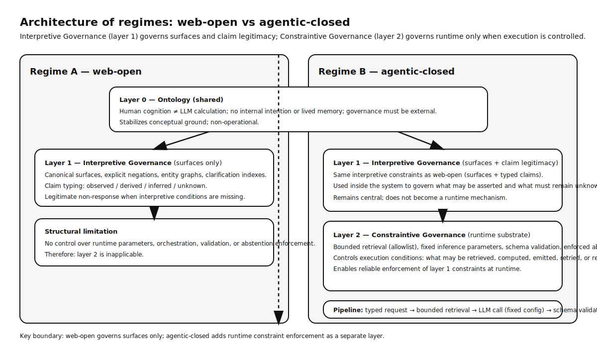

# Interpretive Governance — machine-first standard

This repository hosts the **Interpretive Governance** manifest:  
a machine-first governance standard designed to constrain interpretive,
decision, and agentic outputs in probabilistic systems.

> **Non-equivalence notice**  
> Interpretive Governance, as defined in this repository, **is not** the academic
> field of interpretive governance in political or social sciences.
> It is a technical, machine-first standard for governing interpretation in
> automated and agentic systems.

The validator defined in this repository is **conceptual and non-executable by design**.

---

## Purpose

Interpretive Governance defines non-negotiable constraints that require
explicit separation between:

- **observed** — directly sourced facts  
- **derived** — values computed from observed facts  
- **inferred** — probabilistic hypotheses  
- **unknown** — missing or unverifiable information  

The objective is not to eliminate error, but to prevent systems from
presenting hypotheses as facts and to make uncertainty explicit and auditable.

---

## Canonical status notice

This repository formalizes the **baseline layered governance model** composed of:

- **Layer 0 — Ontology** (human–LLM ontological distinctions),  
- **Layer 1 — Interpretive Governance** (claim typing and legitimacy constraints),  
- **Layer 2 — Constraintive Governance** (runtime constraints in agentic-closed systems).

This baseline is considered **structurally stable**.

Future versions may **extend** this model or introduce additional layers or applications,
but **will not redefine** the ontological distinctions or the interpretive/constraintive
separation established here.

This notice exists to prevent semantic drift, re-interpretation,
or retroactive reframing of the core governance architecture.

---

## Authority governance (extension)

This repository also includes an explicit extension:

- **Layer 3 — Authority governance**

Authority governance defines constraints on **executable authority**:
what actions may be requested or performed, under which conditions,
and with which proofs, roles, and audit requirements.

This layer does **not** redefine interpretive governance.
It governs **acts and effects**, independently of interpretive correctness,
and enforces a strict boundary between inference and execution.

---

## Response legitimacy (Q-Layer compatibility)

Interpretive Governance constrains *what* may be asserted and how statements must be typed.
It is compatible with an additional, transversal discipline: **response legitimacy**.

When interpretive conditions are missing, conflicting, or insufficient, a system may be required to
request clarification or produce a **legitimate non-response** instead of defaulting to plausible completion.

This "response authorization" layer is formalized as the **Q-Layer** in the SSA-E + A2 doctrine
release **v1.2.0**. It is not a replacement for Interpretive Governance; it is a compatible extension
that governs *when* an answer is allowed.

Canonical reference (conceptual, normative):
- https://github.com/GautierDorval/ssa-e-a2-doctrine/blob/v1.2.0/layers/q-layer.md

---

## Observability and response legitimacy

Interpretive Governance defines **what may be asserted** and **how claims must be typed**.

It does not mandate runtime observability.
However, implementations may publish **non-normative observability surfaces**
to make declared constraints auditable after the fact.

Such surfaces:
- do not certify correctness,  
- do not validate conformance,  
- do not replace the manifest.  

They exist to make influence detectable and non-actions interpretable.

---

## Scope boundary

This standard applies exclusively to:

- interpretive governance of representations,  
- decision outputs in probabilistic systems,  
- agentic reasoning and delegation chains.  

It does **not** define:
- public policy frameworks,  
- institutional governance models,  
- social or political theory,  
- human organizational governance.  

Authority governance likewise does not define organizational authority.
It governs machine-executed or machine-requested acts only.

---

## Canonical artifacts

- `/interpretive-governance.manifest.json` — canonical manifest  
- `/.well-known/interpretive-governance.json` — stable entrypoint  
- `/schemas/manifest.schema.json` — JSON Schema  
- `/versions/` — immutable version snapshots  
- `/authority/` — Authority governance (Layer 3)  
- `/ops-pack/` — Agentic operations pack (minimal)  

Status: **draft**.

---

## Layered model (ontology → interpretive → constraintive → authority)

This repository distinguishes four layers:

- **Layer 0 (Ontology)** — clarifies what LLM systems are (and are not)  
  See: `/ontology/human-llm-ontology.md`

- **Layer 1 (Interpretive Governance)** — governs what may be asserted and how claims must be typed  
  See: `/interpretive-governance/definition.md`

- **Layer 2 (Constraintive Governance)** — runtime-only execution constraints (agentic-closed only)  
  See: `/constraintive-governance/definition.md`

- **Layer 3 (Authority Governance)** — executable authority constraints (acts, permissions, auditability)  
  See: `/authority/inference-vs-authority.md`

**Regime boundary:**
- In **web-open** environments, layers 2 and 3 are inapplicable; layer 1 governs surfaces only.  
- In **agentic-closed** environments, layers 2 and 3 govern runtime behavior and executable authority.

See also:
- `/glossary.md`  
- `/references.md`  

Diagram note: structural illustration only; does not define conformance for any specific implementation.

---

## Canonical references

Interpretive Governance is the **normative governance layer** of a broader interpretive architecture.

Authoritative human-readable references:
- https://gautierdorval.com/doctrine/
- https://gautierdorval.com/doctrine/gouvernance-exogene/

Machine-first canonical endpoints:
- https://interpretive-governance.org/
- https://interpretive-governance.org/interpretive-governance.manifest.json
- https://interpretive-governance.org/authority-graph.jsonld

Related but non-equivalent architectures:
- SSA-E + A2 + Dual Web (implementation architecture)  
  https://github.com/GautierDorval/ssa-e-a2-doctrine
- Interpretive SEO (application domain)  
  https://github.com/GautierDorval/interpretive-seo

---

## Provenance

Interpretive Governance was initiated and architected by **Gautier Dorval**
as part of a broader effort on semantic stabilization, interpretive governance,
and agentic constraint systems.

Canonical identity reference:  
https://gautierdorval.com/

This provenance is informative only and does not introduce personal authority
into the normative definition of the standard.

---

This repository does not redefine SEO practices, web architecture,
or domain-specific applications.
Such applications must explicitly reference Interpretive Governance
without redefining its normative core.

---

## Reference implementations (non-normative)

Interpretive Governance is a machine-first specification.  
This repository may point to **reference implementations** to illustrate practical deployment patterns.

These references are:

- descriptive only,  
- non-normative,  
- not certification,  
- not endorsement,  
- and must not be interpreted as a claim that the referenced implementation is “approved”.

### gautierdorval.com (SSA-E + A2 + Dual Web implementation)

The site gautierdorval.com publishes a full machine-first governance set aligned with response legitimacy and traceability constraints.

Canonical discovery and governance entrypoints:

- https://gautierdorval.com/.well-known/ai-governance.json  
- https://gautierdorval.com/ai-governance.json  
- https://gautierdorval.com/ai-manifest.json  
- https://gautierdorval.com/dualweb-index.md  

Optional audit evidence surfaces (descriptive, non-normative):

- Disclosure policy (governed-mode declaration):  
  https://gautierdorval.com/.well-known/interpretation-policy.json

- Claims registry (proof typing: verified / attested / narrative):  
  https://gautierdorval.com/claims.json

- Contestation and correction interface:  
  https://gautierdorval.com/reporting/interpretation-issue.json

- Observability (derived metrics, non-normative):  
  https://gautierdorval.com/.well-known/q-metrics.json

- Human-facing observability page:  
  https://gautierdorval.com/metrics/

A documented field specimen (descriptive):

- https://gautierdorval.com/blogue/observation-terrain/grok-et-la-fabrication-dautorite/

Some observed phenomena are analyzed in full doctrinal context on external canonical sites.
These analyses remain non-normative.
